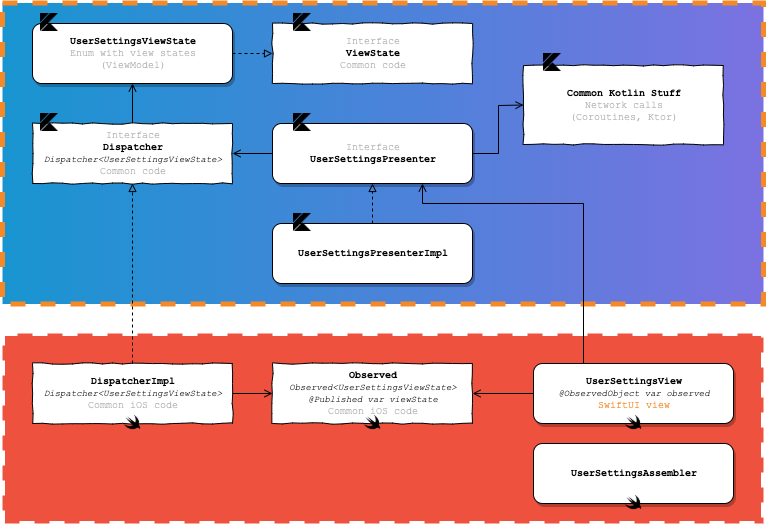

# SwiftUI + Kotlin MPP

Reusable architecture pattern for multiplatform mobile projects with Kotlin Multiplatform & SwiftUI.

## Purpose

This repository describes an architecture pattern for mobile applications. Main advantages below :

* Based on classic decoupled M-V-P structure
* Maximum reuse common code between platforms (view logic & controls with presenters, network layers, ...)
* And so, avoid duplicate work between Android devs and iOS devs for common code and common unit tests
* Use native languages & frameworks for drawing views (SwiftUI/Storyboards for iOS, Compose/XML for Android) for maximum design capabilities

## Architecture overview

  

