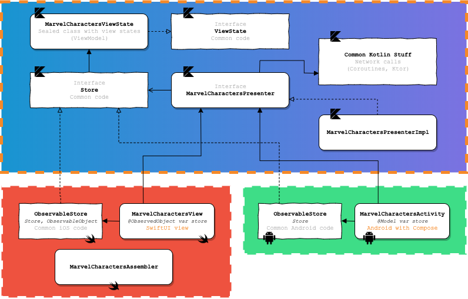

# Kompose

Reusable architecture pattern for multiplatform mobile projects with Kotlin Multiplatform, SwiftUI & Compose.

  

## Purpose

This repository describes an architecture pattern & best practises for a mobile application project. Main advantages below :

* Based on a redux-like pattern / Fully reactive (states)
* Maximum reuse common code between platforms (view logic & controls with presenters, network layers, ...)
* And so, avoid duplicate work between Android devs and iOS devs for common code and common unit tests
* Use native languages & frameworks for drawing views (SwiftUI -or Storyboards- for iOS, Compose -or XML- for Android) for maximum design capabilities

## Example app

The best demo is a working app. You can find the demo app source code [here](https://github.com/jtouzy/SwiftUI-KotlinMPP-MVP/tree/master/Examples/DemoApp).

In this app, we have to list all the marvel characters, and show a detailed view when we select a character.

### Basic example - MarvelCharacters

#### Overview

For having an overview of all pieces we need to build the first screen, let's see this diagram below.

  

As you can see, all the common code is built on a common Kotlin layer, and only the view/reactive stuff, specific to the platforms, are implemented in iOS/Android.

Let's see all the pieces in details.

`<WIP>`
