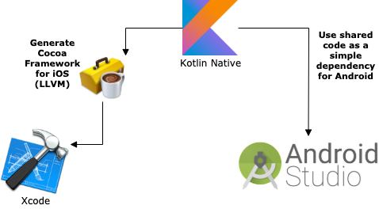

# Kompose

Reusable architecture pattern for multiplatform mobile projects with Kotlin Multiplatform, SwiftUI & Compose.

<p align="center">
  
</p>

**[Try now](#tryit) ⬇️**.

## Purpose

This repository describes an architecture pattern & best practises for a mobile application project. Main advantages below :

* Based on a redux-like pattern / Fully reactive (states)
* Maximum reuse common code between platforms (view logic & controls with presenters, network layers, ...)
* And so, avoid duplicate work between Android devs and iOS devs for common code and common unit tests
* Use native languages & frameworks for drawing views (SwiftUI -or Storyboards- for iOS, Compose -or XML- for Android) for maximum design capabilities

## Kotlin Multiplatform Overview (for mobile)

This architecture is entirely based on the powerful Kotlin Multiplatform system. The main principle is described below :

<p align="center">
  
</p>

With one common Kotlin code, you can generate Cocoa frameworks for iOS development, and also use the same code for an Android app. Kotlin Multiplatform can also be used to generate javascript dependencies or more, but we will not describe it here.

You can discover more about the Kotlin Native features [here](https://kotlinlang.org/docs/reference/native-overview.html).

## Example app

The best demo is a working app. You can find the Breaking Bad Quotes demo app source code [here](https://github.com/jtouzy/Kompose/tree/master/Examples/DemoApp).

In this app, the specs are simple :
* List all Breaking Bad characters.
* Show all Breaking Bad quotes for a selected character.

We will use [the Breaking Bad API](https://breakingbadapi.com/Documentation) for this demo app, to demonstrate how powerful the common code can be with network requests & serialization.

### Characters screen as an example

#### Overview

For having an overview of all pieces we need to build the first screen, let's see this diagram below.

<p align="center">
  
</p>

As you can see, all the common code is built on a common Kotlin layer, and only the view/reactive stuff, specific to the platforms, are implemented in iOS/Android.

Let's see all the pieces in details.

#### Some details

* **ViewState** : A view state is a temporal state of your `View`. 
The state is retained by the `Store`.

* **Store** : A store retains a `ViewState`.
The `Presenter` will send to the `Store` a new view state, and the `View` will react to this and redraw.

*This layer is here to customize how the view will react to a view state update.
In this example, for iOS, SwiftUI binding is used to react to the state change with `ObservableStore`.
But you can also implements another version of the Store, that will handle a Delegate or an Rx Subject to handle state changes, if you can't use SwiftUI yet.*

* **Assembler (iOS)** : An assembler is here to merge it all together.
The assembler will create the whole module, initializing the presenter, the view, and the store, then linking it together.

### Speed up your multiplatform development

#### 🚀 [iOS] Automatically generate a new framework with the last Kotlin classes in each build ?

You can add a `Run Script` to the `Build phases` of your project, which will just launch a gradle `packForXcode` command.
You can find an example of the `build_ios_frameworks.sh` script in the demo app.

#### 🚀 [iOS] Debug Kotlin classes from an imported framework in Xcode ?

Two steps :

* 1/ Use [XcodeSync dependency](https://github.com/touchlab/KotlinXcodeSync) in your Kotlin Native plugin for generating framework : 
* 2/ Use [Xcode plugin](https://github.com/touchlab/xcode-kotlin) for reading *.kt files

The configuration is set in the demo app.

#### 🚀 Use a single locale file for iOS and Android ?

You can use [Twine](https://github.com/scelis/twine) to have a single file reference for all your application locales. Twine is a command line tool that will generate you a `Localizable.strings` file for iOS and a `strings.xml` file for Android, based on a single `.twine` file. 

Again, for iOS, with a simple `Run Script` in your `Build Phases`, you can generate your strings in each build.

You can find an example in the demo app.

### <a name="tryit"></a>Try it yourself

You want to try it ? But doesn't want to loose time with configuration ?
We just provide an utility tool for you to generate the structure of the project, so you can start clean.

For now, it's a bit trivial, until we've published the tool on `brew`.
Clone the repo, execute the `main.py` file, then give your informations, like below :

```sh
JTO @ tmp $ git clone https://github.com/jtouzy/Kompose

Cloning into 'Kompose'...
remote: Enumerating objects: 810, done.
remote: Counting objects: 100% (810/810), done.
remote: Compressing objects: 100% (355/355), done.
remote: Total 1505 (delta 249), reused 759 (delta 211), pack-reused 695
Receiving objects: 100% (1505/1505), 962.43 KiB | 2.47 MiB/s, done.
Resolving deltas: 100% (448/448), done.

JTO @ tmp $ ./Kompose/KomposeCli/main.py

>> Creating a new multi-platform project with Kompose

[1] Your project identifier (example: DemoApp): MyApp  
[2] Your project package (example: com.jtouzy): com.myname
[2] Your project absolute path ('Enter' for this location): 

Creating project directory... /private/tmp/MyApp
Generating files...

>> Your project is ready. Cd here: /private/tmp/MyApp
```

### Issues, ideas

If you have any recommandations, ideas, or issues, please feel free to open a new issue.
