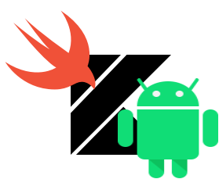
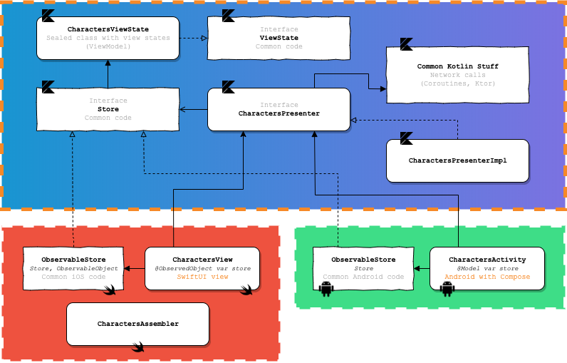

# Kompose

Reusable architecture pattern for multiplatform mobile projects with Kotlin Multiplatform, SwiftUI & Compose.

  

## Purpose

This repository describes an architecture pattern & best practises for a mobile application project. Main advantages below :

* Based on a redux-like pattern / Fully reactive (states)
* Maximum reuse common code between platforms (view logic & controls with presenters, network layers, ...)
* And so, avoid duplicate work between Android devs and iOS devs for common code and common unit tests
* Use native languages & frameworks for drawing views (SwiftUI -or Storyboards- for iOS, Compose -or XML- for Android) for maximum design capabilities

## Kotlin Multiplatform Overview (for mobile)

This architecture is entirely based on the powerful Kotlin Multiplatform system. The main principle is described below :

  

With one common Kotlin code, you can generate Cocoa frameworks for iOS development, and also use the same code for an Android app. Kotlin Multiplatform can also be used to generate javascript dependencies or more, but we will not describe it here.

You can discover more about the Kotlin Native features [here](https://kotlinlang.org/docs/reference/native-overview.html).

## Example app

The best demo is a working app. You can find the Breaking Bad Quotes demo app source code [here](https://github.com/jtouzy/Kompose/tree/master/Examples/DemoApp).

In this app, the specs are simple :
* List all Breaking Bad characters.
* Show all Breaking Bad quotes for a selected character.

We will use [the Breaking Bad API](https://breakingbadapi.com/Documentation) for this demo app, to demonstrate how powerful the common code can be with network requests & serialization.

### Characters screen as an example

#### Overview

For having an overview of all pieces we need to build the first screen, let's see this diagram below.

  

As you can see, all the common code is built on a common Kotlin layer, and only the view/reactive stuff, specific to the platforms, are implemented in iOS/Android.

Let's see all the pieces in details.

`<WIP>`

#### Debugging features

* 1/ Use [XcodeSync dependency](https://github.com/touchlab/KotlinXcodeSync) in your Kotlin Native plugin for generating framework : 
* 2/ Use [Xcode plugin](https://github.com/touchlab/xcode-kotlin) for reading *.kt files
